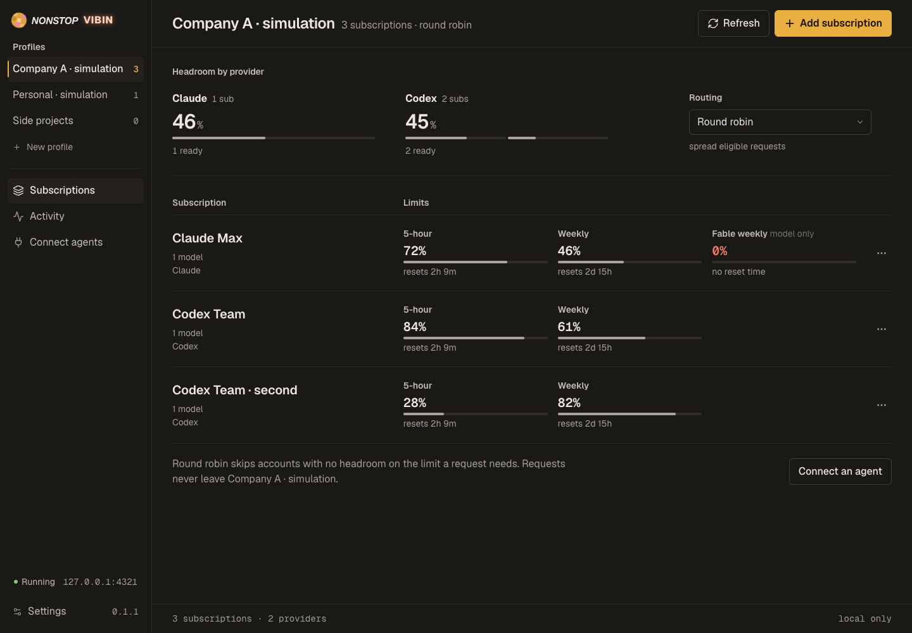
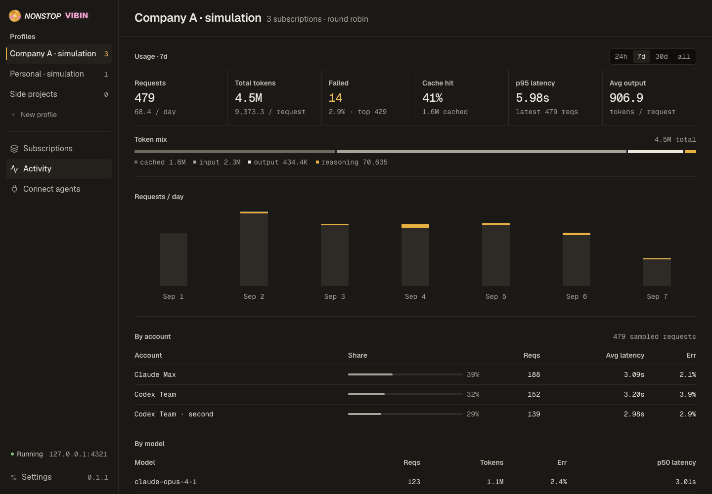
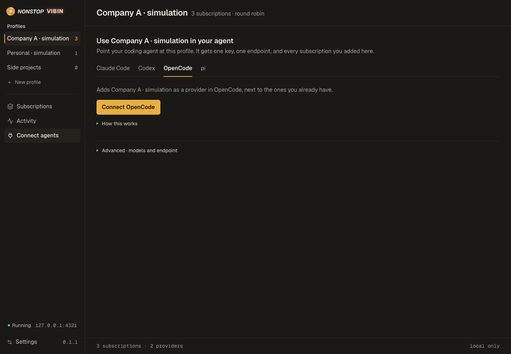

<p align="center">
  
</p>

# nonstopvibin

Keep work and personal AI subscriptions separate. Connect each profile to your coding agents.

A local desktop app for macOS and Linux, built on [CLIProxyAPI](https://github.com/router-for-me/CLIProxyAPI). Each profile has its own accounts, API key, and endpoint. When a profile runs out of quota, its requests fail within that profile.

[Get started](#get-started) · [Agent setup](docs/agent-setup.md) · [Provider support](docs/providers.md) · [Development](docs/development.md)



## Features

- Keep account pools separate for work, personal use, or individual projects.
- Route requests between accounts within a profile using round robin or fill first, with optional session affinity.
- Connect Claude Code, Codex, and pi through their native configuration.
- Check quota windows and reset times in the app or its menu bar popup.
- Inspect request history and observed token usage, then export the displayed records as CSV.
- Add subscriptions through provider sign-in, API keys, or existing CLIProxyAPI account files.

The gateway supports OpenAI Chat Completions and Responses, Anthropic Messages, SSE, and Responses WebSocket forwarding. See [provider support and test limits](docs/providers.md) before choosing a connection method.

## Get started

This is a prerelease. Until the first signed release, macOS shows an unsigned app warning. Linux requires a secret service such as GNOME Keyring or KWallet; the app refuses plaintext credential storage.

### Download

Download the latest build from [GitHub Releases](https://github.com/samuelfarkas/nonstopvibin/releases). The macOS build supports Apple Silicon (arm64) only; Linux builds target x86_64. Each release includes a `SHA256SUMS` file and GitHub build provenance. Verify a downloaded file with:

```sh
gh attestation verify <file> --owner samuelfarkas
```

The app does not auto-update. Download new releases manually.

On macOS, open the DMG and drag nonstopvibin to Applications. Until the first signed release, macOS shows an unsigned app warning and may require **System Settings > Privacy & Security > Open Anyway**.

### Build from source

Install [Bun 1.4.2](https://bun.com/docs/installation) and Git, then run these commands from the project folder:

```sh
bun run setup
bun run build
bun run start
```

Setup installs the locked dependencies and downloads the checksum-pinned CLIProxyAPI 7.2.151 core. The desktop app uses Electron's runtime; users of a packaged installer do not need Bun.

To make an installer, run the matching command on the target system:

| System | Command              | Output                         |
| ------ | -------------------- | ------------------------------ |
| macOS  | `bun run dist:mac`   | DMG in `release/`              |
| Linux  | `bun run dist:linux` | AppImage and deb in `release/` |

### Connect your first agent

1. Create a profile, such as **Work** or **Personal**.
2. Choose **Add subscription**, select the destination profile, and sign in, enter an API key, or import an existing account file.
3. Start the profile. Under **Connect agents**, check the available models and choose your agent.
4. Follow the connection instructions shown in the app. Claude Code also needs a project folder.

Selecting another profile in the app only changes the view. It does not move an agent's existing conversation. The [agent setup guide](docs/agent-setup.md) explains model selection, reconnecting, and removing a connection.

Closing the main window keeps the proxy and menu bar running. **Quit** stops them. On macOS, **⌘⇧U** opens quotas and **⌘1** returns to the main window. Automatic startup is optional in Settings.

<details>
<summary>Activity and agent connection screenshots</summary>





</details>

## Privacy and storage

The gateway listens on `127.0.0.1`. Profile API keys cannot access management endpoints. Desktop secrets in SQLite use Electron safeStorage, backed by macOS Keychain or a Linux secret service.

CLIProxyAPI also needs plaintext credential files on disk. The app restricts these files and their directories to your OS user. Profiles separate account pools; they do not protect credentials from other software running as that user.

Activity stores request metadata and token counts, not prompts, responses, API keys, or raw provider errors. Token accounting can lose events during a crash and is not a billing ledger. [Storage locations and boundaries](docs/architecture.md) describe the details.

Read the [security policy](SECURITY.md) before distributing a build. Keep credentials and provider responses out of public issues.

## Development

```sh
bun run dev          # Local API and Vite; open the printed session URL
bun run preview      # Isolated simulator with synthetic accounts
bun run quality      # TypeScript, Oxlint, and Oxfmt
bun test             # Local fixtures and the verified proxy core
```

[Development commands](docs/development.md) cover formatting, packaging, and security checks. [AGENTS.md](AGENTS.md) records the repository's architecture rules and contributor skills.

## Contributing

See [CONTRIBUTING.md](CONTRIBUTING.md) before opening a pull request.

## License

[MIT](LICENSE). CLIProxyAPI and bundled dependencies retain their own licenses; see [third-party notices](licenses/NOTICE.md). Provider names and logos belong to their respective owners. This project is not affiliated with those providers.
